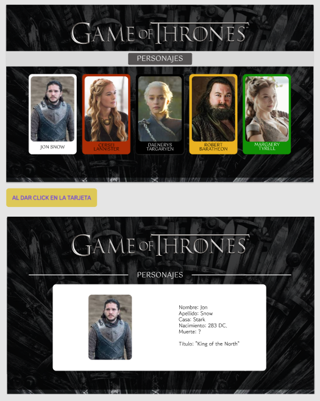

<strong>DATA LOVERS: GAME OF THRONES</strong>

Esta página web está enfocada en proporcionar información sobre los personajes de la serie "Juego de Tronos". En la plataforma, los usuarios pueden encontrar características específicas de cada personaje, como su nombre completo, la familia a la que pertenecen, sus títulos, y los años de nacimiento y muerte.

Al desarrollar esta interfaz, nos dimos cuenta de que es difícil retener información sobre tantos personajes al ver la serie, ya que rara vez se les proporciona un contexto detallado sobre sus vidas. Esto puede hacer que sea complicado seguir la trama.

Para abordar este problema, realizamos encuestas a usuarias que se consideraban fanáticas de la serie,y también a personas que nunca se habían aproximado a la saga, pero que estaban interesadas en conocer más sobre la serie y los personajes. Las preguntas se centraron en su nivel de familiaridad con el mundo de "Juego de Tronos", es decir, si habían visto la serie o leído los libros. Además, preguntamos qué aspectos consideraban relevantes conocer acerca de los personajes y cuál sería una estadística divertida o curisosa. 

Gracias a los datos recopilados, pudimos comenzar a desarrollar las "Historias de Usuarias". Trabajamos en un total de 6 historias que nos permitieron presentar a los personajes principales de manera didáctica y sencilla.

<strong>Dividimos las "Historias de Usuarios" de la siguiente manera:</strong>

Historia 1: Visualizar las fotos de cada uno de los personajes de "Juego de Tronos" junto a sus nombres. 
Historia 2: Filtrar a los personajes por sus respectivas "Casas". 
Historia 3: Permitir a los usuarios ordenar a los personajes alfabéticamente y de forma ascendente o descendente antes o después de aplicar el filtro por casa. 
Historia 4: Implementación de un botón que permita a los usuarios restablecer el filtro y el orden. 
Historia 5: Filtrar a los personajes según su estado de vida, es decir, si están vivos o muertos. 
Historia 6: Visualizar una estadística al momento de filtrar por casas, mostrando la cantidad de personajes que sobreviven. 

Además, creamos bocetos de alta y baja fidelidad para cada una de las historias de usuaria. Al comenzar a trabajar en el proyecto, queríamos que la interfaz tuviera un estilo oscuro y sofisticada que mostrara únicamente la información necesaria. Aquí pueden ver uno de los bocetos iniciales:

Este boceto sufrió algunas modificaciones relacionadas con los estilos CSS, que consideramos necesarias para el producto final. Descartamos algunas ideas, como la de colorear cada tarjeta asociada a la casa del personaje, y nos enfocamos en una visualización general más sobria, esperando que no fuera demasiado llamativa, de manera similar a como ocurre en "Juego de Tronos".

Finalmente, decidimos agregar una pantalla inicial de Bienvenida, donde las usuarias podrán escuchar la melodía de "Juego de Tronos", conocer un poco el contexto de la interfaz y así darle más anticipación a una página web que simplemente busca mostrar este set de datos.

Chris y Carol.